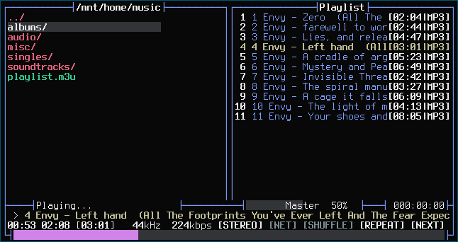

# moc-theme-moonfly
[moc](https://moc.daper.net/) theme based on [vim-moonfly-colors](https://github.com/bluz71/vim-moonfly-colors)

screenshot
----------

installation
------------
requires terminal with moonfly colorscheme and opaque background

place `./moonfly` into `~/.moc/themes/` to install. edit `~/.moc/config` and define `Theme = moonfly` to use.
